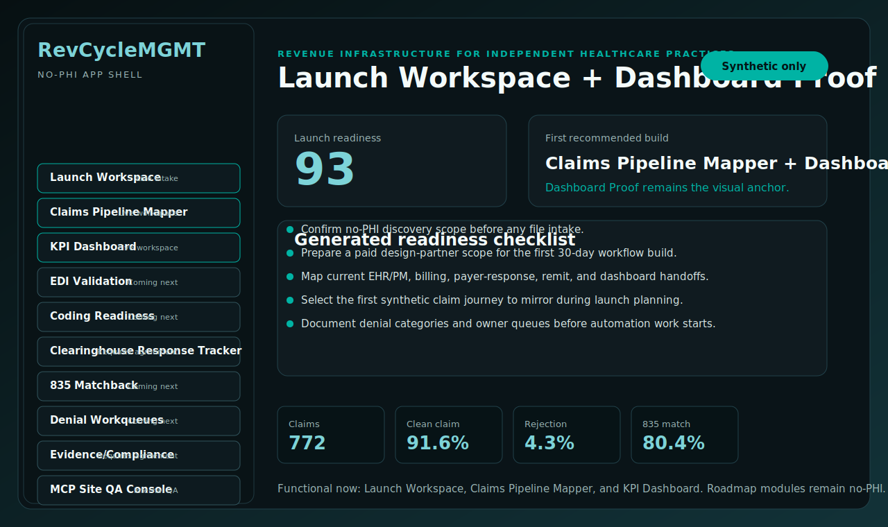
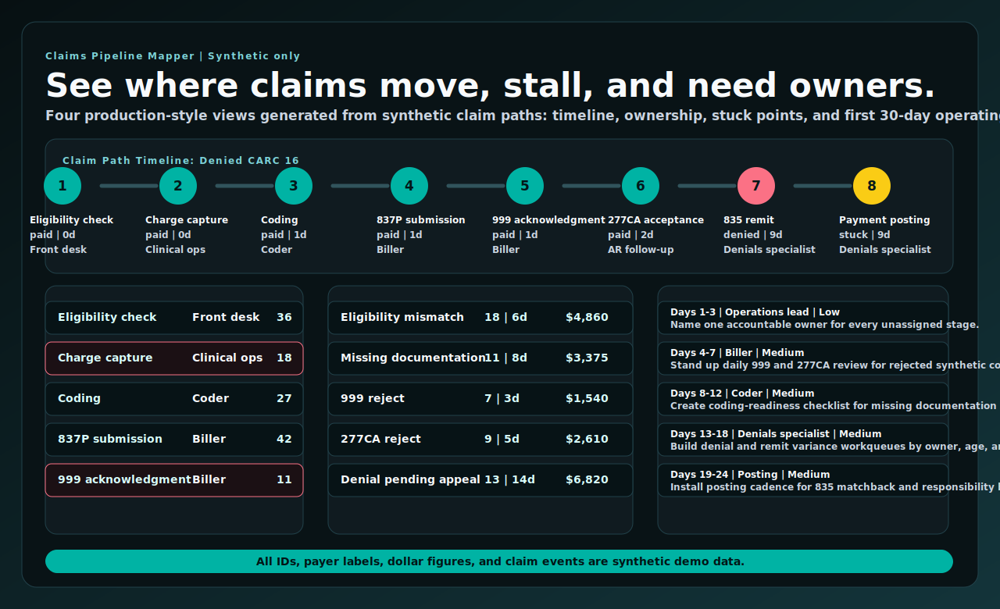
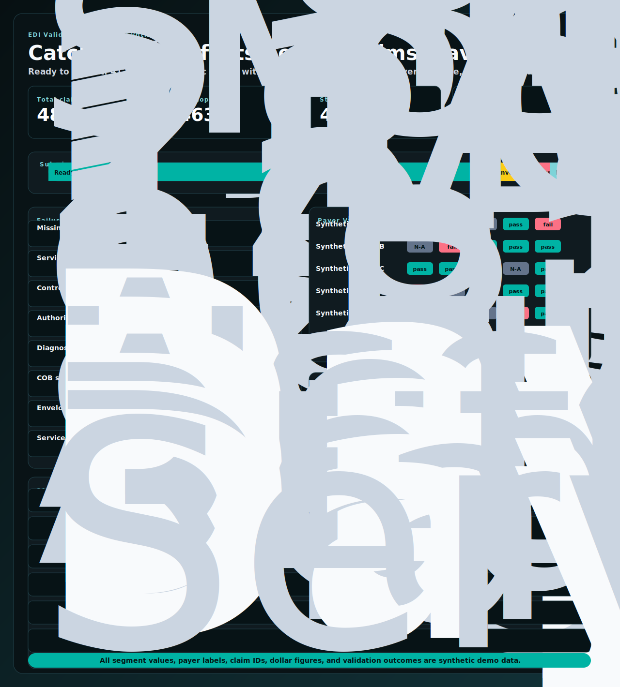

# RevCycleMGMT App Shell


Startup clinicians do not just need a billing vendor list. They need to see where claims will move, who owns each handoff, and what breaks first when volume starts. RevCycleMGMT App Shell turns that operating question into a no-PHI product console: Launch Workspace, Claims Pipeline Mapper, dashboard proof view, and reserved navigation for the full revenue-infrastructure roadmap without accepting production healthcare data.



## What This Repo Proves

| Area | Proof |
|---|---|
| App shell | Sidebar navigation reserves the complete roadmap: Launch Workspace, Claims Pipeline Mapper, KPI Dashboard, EDI Validation, Coding Readiness, Clearinghouse Response Tracker, 835 Matchback, Denial Workqueues, Evidence/Compliance, and MCP Site QA Console. |
| No-PHI Launch Workspace | Synthetic startup-clinic intake generates a launch readiness score, first-build recommendation, readiness checklist, and synthetic claims journey preview. |
| Claims Pipeline Mapper | Five synthetic claim paths render a timeline, ownership map, stuck-point inventory, and first 30-day action plan. |
| KPI Dashboard | Five action-grade KPIs render with targets, owner cues, freshness badges, 13-week trend lines, breakdown risk, and a generated 30-day action plan. |
| EDI Validation Harness | Synthetic claim batches render readiness checks, failure catalog, payer variance map, and a 30-day repair plan. |
| Clearinghouse Response Tracker | Synthetic response timelines render 999, 277CA, and 277 movement, parser interpretation, stuck inventory, and a 30-day tracking plan. |
| Safety boundary | Intake validation rejects PHI-shaped input and forbidden public-positioning terms before a workspace is generated. |
| Testable surface | Route tests verify every app path returns 200, PHI-shaped inputs are rejected, and generated artifacts remain synthetic. |

## Proven, Demo-Only, Requires Agreement

| Category | Current status |
|---|---|
| Proven | This repo generates a local app shell, SVG proof artifacts, route-rendered HTML views, synthetic launch workspace output, Claims Pipeline Mapper workspace, KPI Dashboard workspace, EDI Validation Harness workspace, Clearinghouse Response Tracker workspace, and tests. The five workflow proof tracks remain the source proof set for coding review and remit/denial operations. |
| Demo-only | The Launch Workspace, Claims Pipeline Mapper, KPI Dashboard, EDI Validation Harness, Clearinghouse Response Tracker, reserved modules, synthetic claim journey, readiness checklist, and first 30-day action plans are public demo surfaces. They do not process production files. |
| Requires production agreements | Real client data, EHR/PM exports, payer credentials, clearinghouse credentials, claim files, remittance files, production integrations, secure file intake, user accounts, and client-specific operational work. |

## Claims Pipeline Mapper

Claim-path breakdown is the handoff a buyer wants after launch intake: what happens first, who owns it, where do claims stall, and what should week one look like? The mapper answers that with synthetic-only operating evidence instead of production data.



Open the running route locally:

```text
http://127.0.0.1:8765/app/claims-pipeline
```

The workspace has four views:

| View | What it proves |
|---|---|
| Claim Path Timeline | Five selectable synthetic claim paths: clean, rejected at 999, denied CARC 16, partial pay with CO-45, and patient-responsibility balance. |
| Ownership Map | Owner role, queue load, and unassigned ownership slots by claim stage. Unassigned slots are intentionally loud. |
| Stuck-Point Inventory | Synthetic stalled cohorts grouped by eligibility mismatch, missing documentation, acknowledgment rejects, denial appeal, no-response payer, and posting backlog. |
| First 30-Day Action Plan | Ordered operating checklist with target owner, effort, and expected impact for the first month of cleanup. |

Synthetic data path:

```text
src/revcyclemgmt_app_shell/claims_pipeline.py
  -> /app/claims-pipeline
  -> docs/assets/claims-pipeline-mapper-proof.svg
  -> output_demo/claims_pipeline_mapper_summary.json
```

The mapper uses invented claim IDs, invented payer labels, invented dollar figures, and invented acknowledgment/remit states. It does not accept or ship PHI, real payer responses, production remit files, production claim files, credentials, or client exports.

## RCM Dashboard KPI Workspace

A clinic owner does not need vanity charts. They need to know whether claims are leaving cleanly, whether first-pass work is holding, where denials are rising, how old open revenue is getting, and whether collectible dollars are turning into cash. The Dashboard workspace turns those questions into one synthetic operating console.


Open the running route locally:

```text
http://127.0.0.1:8765/app/dashboard
```

What a clinic owner sees in 30 seconds: the five numbers that determine whether the launch path is healthy, the three worst rows by operating slice, and the first actions to assign this month.

| KPI | What it measures |
|---|---|
| Clean claim rate | Clean synthetic claims divided by submitted synthetic claims. |
| First-pass yield | Synthetic claims accepted and adjudicated without rework on the first path. |
| Denial rate | Denied synthetic claims divided by adjudicated synthetic claims. |
| Days in A/R | Average synthetic claim age before payment visibility or closure. |
| Net collection rate | Synthetic allowed collections divided by synthetic collectible revenue. |

The workspace has four views:

| View | What it proves |
|---|---|
| Headline Scorecard | KPI cards show current value, 90-day target, delta, owner, status, and stale-data badges. |
| 13-Week Trend | Static SVG trend lines show movement for all five headline KPIs across synthetic weekly buckets. |
| Breakdowns | The same KPIs are sliced by payer, CARC code, specialty, and claim type, with visible worst-three callouts. |
| 30-Day Action Plan | Ordered work items are generated from the highest-risk breakdown rows with owner, effort, and expected impact. |

Synthetic data path:

```text
src/revcyclemgmt_app_shell/dashboard.py
  -> /app/dashboard
  -> docs/assets/rcm-dashboard-proof.svg
  -> output_demo/rcm_dashboard_summary.json
```

The dashboard uses invented KPI values, payer labels, CARC examples, specialties, dates, dollar figures, queue signals, and owner assignments. It does not accept or ship PHI, production claim files, production remits, payer credentials, client exports, or live source-system data.

## EDI Validation Harness

A clinic owner does not need to read transaction syntax to know whether a batch is safe to send. The EDI Validation Harness turns pre-submission defects into a readiness score, a repair catalog, payer-specific requirement map, and a 30-day owner plan before production healthcare data is introduced.



Open the running route locally:

```text
http://127.0.0.1:8765/app/edi-validation
```

The workspace has four views:

| View | What it proves |
|---|---|
| Submission Readiness Check | Shows how many synthetic claims are ready to submit after envelope, structure, and synthetic business-rule checks. |
| Failure Catalog | Ranks the top pre-submission failures by synthetic frequency and dollar exposure, then translates each into an operating fix. |
| Payer Variance Map | Compares five synthetic payer routes so requirement drift is visible before a batch goes out. |
| 30-Day Readiness Plan | Converts the highest-risk failure and payer rows into owner-ready work with effort and expected impact. |

Synthetic data path:

```text
src/revcyclemgmt_app_shell/edi_validation.py
  -> /app/edi-validation
  -> docs/assets/edi-validation-harness-proof.svg
  -> output_demo/edi_validation_summary.json
```

The harness uses invented claim IDs, payer labels, segment values, dates, dollar figures, requirement outcomes, and validation results. It does not accept or ship PHI, production claim files, production payer responses, credentials, client exports, or live source-system data.

## Clearinghouse Response Tracker

A submitted claim is not operationally safe just because it left the billing queue. The Clearinghouse Response Tracker shows whether synthetic claims are moving through acknowledgment and status-response stages, which claims are stuck past SLA, and what the team should assign next.


Open the running route locally:

```text
http://127.0.0.1:8765/app/clearinghouse-responses
```

The workspace has four views:

| View | What it proves |
|---|---|
| Submission Timeline | Tracks 12 synthetic claims across submitted, 999, 277CA, and 277 response stages with current state and SLA signal. |
| Response Parser View | Turns raw 999, 277CA, and 277 response segments into operating language a buyer can act on. |
| Stuck-in-Clearinghouse Inventory | Groups past-SLA synthetic claims by missing response stage with owner, exposure, and next action. |
| 30-Day Tracking Plan | Converts the worst stuck rows and most common parser signals into owner-ready response-tracking work. |

Synthetic data path:

```text
src/revcyclemgmt_app_shell/clearinghouse_responses.py
  -> /app/clearinghouse-responses
  -> docs/assets/clearinghouse-responses-proof.svg
  -> output_demo/clearinghouse_responses_summary.json
```

The tracker uses invented claim IDs, payer labels, segment values, dates, dollar figures, response timestamps, and status codes. It does not accept or ship PHI, production payer responses, production claim files, credentials, client exports, or live source-system data.

## App Routes

| Route | Status |
|---|---|
| `/app/intake` | Functional Launch Workspace |
| `/app/launch-workspace` | Functional Launch Workspace |
| `/app/dashboard` | Functional KPI Dashboard |
| `/app/claims-pipeline` | Functional Claims Pipeline Mapper |
| `/app/edi-validation` | Functional EDI Validation Harness |
| `/app/coding-readiness` | Coming next placeholder |
| `/app/clearinghouse-responses` | Functional Clearinghouse Response Tracker |
| `/app/835-matchback` | Coming next placeholder |
| `/app/denial-workqueues` | Coming next placeholder |
| `/app/evidence` | Requires agreement placeholder |
| `/app/site-qa` | Internal QA placeholder |

## Workflow

```mermaid
flowchart LR
    A[No-PHI intake] --> B[Launch readiness score]
    B --> C[Generated checklist]
    C --> D[Claims Pipeline Mapper]
    D --> E[Synthetic stuck-point inventory]
    E --> F[First 30-day action plan]
    F --> G[KPI Dashboard]
    G --> H[EDI Validation Harness]
    H --> I[Clearinghouse Response Tracker]
    I --> J[Contact handoff / first-build recommendation]
```



## Local Quickstart

```bash
python3 -m venv .venv
source .venv/bin/activate
pip install -e ".[test]"
python -m revcyclemgmt_app_shell.artifacts --out output_demo
pytest -q
python -m revcyclemgmt_app_shell.server --port 8765
```

Open `http://127.0.0.1:8765/app/intake`.

Expected artifact summary:

```json
{
  "artifact_count": 13,
  "readiness_score": 93
}
```

## Generated Artifacts

| Artifact | Purpose |
|---|---|
| `docs/assets/app-shell-proof.svg` | README-facing SVG proof of the app shell and Launch Workspace. |
| `docs/assets/claims-pipeline-mapper-proof.svg` | README-facing SVG proof of the four-view Claims Pipeline Mapper. |
| `docs/assets/rcm-dashboard-proof.svg` | README-facing SVG proof of the four-view KPI Dashboard workspace. |
| `docs/assets/edi-validation-harness-proof.svg` | README-facing SVG proof of the four-view EDI Validation Harness. |
| `docs/assets/clearinghouse-responses-proof.svg` | README-facing SVG proof of the four-view Clearinghouse Response Tracker. |
| `docs/assets/dashboard-proof-anchor.svg` | Dashboard Proof visual anchor copied from the existing synthetic dashboard track. |
| `output_demo/app_shell_proof.svg` | Regenerated proof artifact. |
| `output_demo/claims_pipeline_mapper_proof.svg` | Regenerated Claims Pipeline Mapper proof artifact. |
| `output_demo/rcm_dashboard_proof.svg` | Regenerated RCM Dashboard KPI proof artifact. |
| `output_demo/rcm_dashboard_summary.json` | Synthetic dashboard data used by the route and SVG. |
| `output_demo/edi_validation_harness_proof.svg` | Regenerated EDI Validation Harness proof artifact. |
| `output_demo/edi_validation_summary.json` | Synthetic EDI validation data used by the route and SVG. |
| `output_demo/clearinghouse_responses_proof.svg` | Regenerated Clearinghouse Response Tracker proof artifact. |
| `output_demo/clearinghouse_responses_summary.json` | Synthetic response tracker data used by the route and SVG. |
| `output_demo/claims_pipeline_mapper_summary.json` | Synthetic mapper data used by the route and SVG. |
| `output_demo/app_shell_summary.json` | Synthetic workspace summary, dashboard metrics, and checklist. |

## Repository Layout

```text
.github/workflows/ci.yml                 # Test workflow
docs/assets/app-shell-proof.svg          # Generated README visual proof
docs/assets/claims-pipeline-mapper-proof.svg # Generated mapper visual proof
docs/assets/rcm-dashboard-proof.svg      # Generated dashboard visual proof
docs/assets/edi-validation-harness-proof.svg # Generated EDI validation visual proof
docs/assets/clearinghouse-responses-proof.svg # Generated response tracker visual proof
docs/assets/dashboard-proof-anchor.svg   # Dashboard visual anchor
docs/website-card-copy.md                # Sixth-card / Apps-page copy
output_demo/                             # Generated synthetic artifacts
src/revcyclemgmt_app_shell/              # App shell package
tests/test_app_shell.py                  # Route, privacy-boundary, and artifact tests
COMPLIANCE.md
SECURITY.md
```

## Public Safety Boundary

This repository is synthetic-only. It does not contain PHI, production claims, payer files, payment files, credentials, EHR/PM exports, screenshots with identifiers, or client extracts.

Production use requires formal agreements, access controls, audit logging, retention rules, source-system validation, and client approval before live healthcare data is used.

## Status

This repo is ready for public portfolio use as a product-console proof. It is not represented as a production application.
