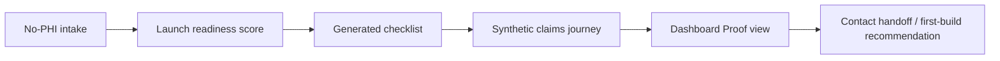

# RevCycleMGMT App Shell


RevCycleMGMT App Shell is the first product-console build from the public product roadmap. It gives independent healthcare practices a no-PHI Launch Workspace, a dashboard proof view, and reserved navigation for the full revenue-infrastructure roadmap without accepting production healthcare data.


## What This Repo Proves

| Area | Proof |
|---|---|
| App shell | Sidebar navigation reserves the complete roadmap: Launch Workspace, Claims Pipeline Mapper, KPI Dashboard, EDI Validation, Coding Readiness, Clearinghouse Response Tracker, 835 Matchback, Denial Workqueues, Evidence/Compliance, and MCP Site QA Console. |
| No-PHI Launch Workspace | Synthetic startup-clinic intake generates a launch readiness score, first-build recommendation, readiness checklist, and synthetic claims journey preview. |
| Dashboard continuity | The dashboard route embeds the existing visual proof pattern so the app feels connected to the RCM Dashboard track and portfolio funnel. |
| Safety boundary | Intake validation rejects PHI-shaped input and forbidden public-positioning terms before a workspace is generated. |
| Testable surface | Route tests verify every app path returns 200, PHI-shaped inputs are rejected, and generated artifacts remain synthetic. |

## Proven, Demo-Only, Requires Agreement

| Category | Current status |
|---|---|
| Proven | This repo generates a local app shell, SVG proof artifact, route-rendered HTML views, synthetic launch workspace output, and tests. The five existing public proof tracks remain the source proof set for claims pipeline, EDI validation, coding review, remit/denial operations, and dashboard KPIs. |
| Demo-only | The Launch Workspace, Dashboard view, reserved modules, synthetic claim journey, and readiness checklist are public demo surfaces. They do not process production files. |
| Requires production agreements | Real client data, EHR/PM exports, payer credentials, clearinghouse credentials, claim files, remittance files, production integrations, secure file intake, user accounts, and client-specific operational work. |

## App Routes

| Route | Status |
|---|---|
| `/app/intake` | Functional Launch Workspace |
| `/app/launch-workspace` | Functional Launch Workspace |
| `/app/dashboard` | Functional synthetic Dashboard Proof |
| `/app/claims-pipeline` | Coming next placeholder |
| `/app/edi-validation` | Coming next placeholder |
| `/app/coding-readiness` | Coming next placeholder |
| `/app/clearinghouse-responses` | Requires agreement placeholder |
| `/app/835-matchback` | Coming next placeholder |
| `/app/denial-workqueues` | Coming next placeholder |
| `/app/evidence` | Requires agreement placeholder |
| `/app/site-qa` | Internal QA placeholder |

## Workflow



## Local Quickstart

```bash
python3 -m venv .venv
source .venv/bin/activate
pip install -e ".[test]"
python -m revcyclemgmt_app_shell.artifacts --out output_demo
pytest -q
python -m revcyclemgmt_app_shell.server --port 8765
```

Open `http://127.0.0.1:8765/app/intake`.

Expected artifact summary:

```json
{
  "artifact_count": 3,
  "readiness_score": 93
}
```

## Generated Artifacts

| Artifact | Purpose |
|---|---|
| `docs/assets/app-shell-proof.svg` | README-facing SVG proof of the app shell and Launch Workspace. |
| `docs/assets/dashboard-proof-anchor.svg` | Dashboard Proof visual anchor copied from the existing synthetic dashboard track. |
| `output_demo/app_shell_proof.svg` | Regenerated proof artifact. |
| `output_demo/app_shell_summary.json` | Synthetic workspace summary, dashboard metrics, and checklist. |

## Repository Layout

```text
.github/workflows/ci.yml                 # Test workflow
docs/assets/app-shell-proof.svg          # Generated README visual proof
docs/assets/dashboard-proof-anchor.svg   # Dashboard visual anchor
docs/website-card-copy.md                # Sixth-card / Apps-page copy
output_demo/                             # Generated synthetic artifacts
src/revcyclemgmt_app_shell/              # App shell package
tests/test_app_shell.py                  # Route, privacy-boundary, and artifact tests
COMPLIANCE.md
SECURITY.md
```

## Public Safety Boundary

This repository is synthetic-only. It does not contain PHI, production claims, payer files, payment files, credentials, EHR/PM exports, screenshots with identifiers, or client extracts.

Production use requires formal agreements, access controls, audit logging, retention rules, source-system validation, and client approval before live healthcare data is used.

## Status

This repo is ready for public portfolio use as a product-console proof. It is not represented as a production application.
